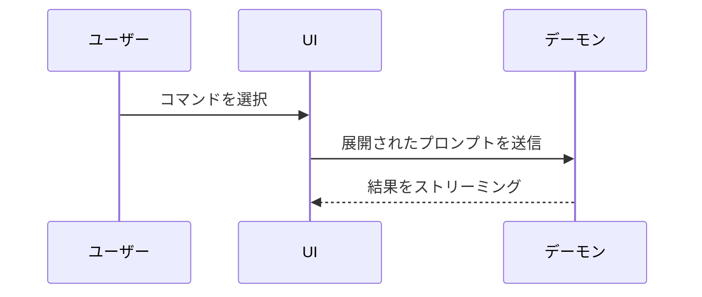

現在会話しているトピックを視覚的に理解できるよう支援します。前置きを省き、説明文は簡潔に保ちます。要点が最も明確に伝わる最小限の表現形式を選択してください。

- ロジックやアルゴリズムを**疑似コード**で表現する:

```text
on(save)
  if content is unchanged
    return cached result
  write new content
  return fresh result
```

- 実行時の制御フローを**コールツリー**で表現する:

```text
submitForm
  createSession
    persistPrompt
    launchAgent
  navigateToSession
```

- UI構造を、関連する状態やモジュール境界を含めた**コンポーネントツリー**で表現する:

```tsx
<SessionPage> (apps/example/src/routes/session.tsx)
  useSessionEvents()
  <SessionToolbar>
    <RunSkillButton> (packages/ui)
```

- ファイルの責務分担や広範囲のリファクタリングを**浅いファイルツリー**で表現する:

```text
src/
├── commands/       # ユーザーのアクションをパース
├── sessions/       # セッション状態を保持
└── transport/      # APIリクエストを送信
```

- コンポーネント間の対話、制御フロー、データフローを **Mermaid** で表現する:



- 既存の構造が存在し「何が変更されるか」が論点である場合は **`diff`** を使用する。論点に合わせて差分の形式を選択してください。

コンポーネントの変更の場合:

```diff
 <SessionPage>
   useSessionEvents()
   <SessionToolbar>
+    <RunSkillButton />
   <SessionTimeline>
+    <SkillResultCard />
```

ファイル配置の変更の場合:

```diff
 src/
 ├── commands/
+│   └── show-me.ts       # スラッシュコマンドを展開
 ├── sessions/
-└── transport.ts
+└── transport/
+    ├── client.ts
+    └── stream.ts
```

コールツリーやコールスタックの変更の場合:

```diff
 submitForm
   createSession
     persistPrompt
+    expandSkillMention
     launchAgent
-  navigateToSession
+  navigateToSession
+    subscribeToEvents
```

状態や制御フローの変更の場合:

```diff
 on(save)
-  write content
+  if content is unchanged
+    return cached result
+  write new content
+  invalidate cache
```

- 変更の大部分が新規である場合、文脈を省略すると所有関係や順序が見えなくなる場合、またはユーザーがコピー可能な完成形を必要としている場合は、**コードブロック全体**を提示する:

```ts
function expandSkill(command: string): string {
  const skillName = command.slice(1)
  return `use the ${skillName} skill`
}
```

- 視覚的なUI、レイアウト、状態の比較、またはMermaidでは表現しきれない複雑な概念の場合は、焦点を絞った単一の**HTMLファイル**（図解、インフォグラフィック、スライドなど、論点に最適な形式）を作成する。保存先はユーザーのOSの一時ディレクトリとします。プロダクトの配色・フォント・余白・コンポーネントと調和させ、実用的なラベルや実データを使用し、デスクトップとモバイルの両方に対応させてください。作成後、ユーザーのためにファイルを開きます：

```
Bash(open path/to/show-me-{説明}.html)
```

## ガイドライン

各ビジュアルは、それが補足する簡潔なテキストのすぐ隣に配置してください。ユーザーの現在の質問に答えるため、または議論中の選択肢を解決するために真に必要な呼び出し、ファイル、props、状態、境界のみを残してください。

状況に応じてこれらの表現形式から1つ、あるいは複数を組み合わせて使用します。すべてを同時に使う必要はありません。適切に判断し、情報過多を避けて要点に絞って提示してください。
